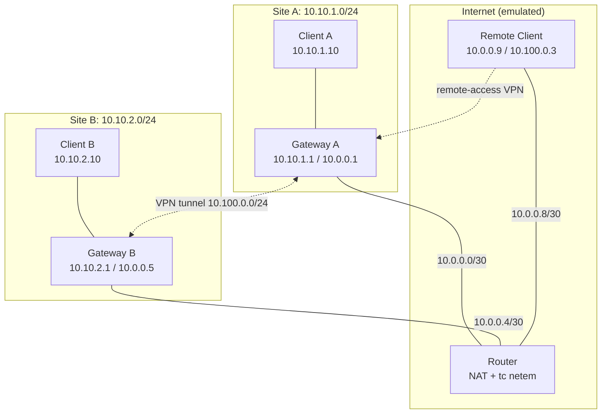

# Virtual Private Network App

**Remote-Access and Site-to-Site VPN with WireGuard: Tunneling, Overhead and MTU**

## Overview

A study of how VPN tunneling affects packet size, effective MTU, latency, throughput and loss. We build site-to-site and remote-access VPNs with **WireGuard** and **OpenVPN** inside one Linux machine using network namespaces, then measure and compare them.

## Objectives

- Build WireGuard site-to-site and remote-access VPNs, plus OpenVPN (UDP and TCP) for comparison
- Measure encapsulation overhead and effective tunnel MTU from packet captures
- Demonstrate fragmentation, ICMP "fragmentation needed" and drops under a wrong MTU
- Compare baseline, WireGuard, OpenVPN-UDP and OpenVPN-TCP under packet loss

## Architecture

| Network | Purpose |
|---|---|
| `10.10.1.0/24` | Site A LAN |
| `10.10.2.0/24` | Site B LAN |
| `10.0.0.0/30`, `10.0.0.4/30`, `10.0.0.8/30` | Gateway A, Gateway B and remote client links to router |
| `10.100.0.0/24` | VPN tunnel network |

## Technologies

IPv4 / NAT, TCP / UDP, ICMP / Path MTU Discovery, WireGuard, OpenVPN, Linux netns, `tc netem`, iperf3, tcpdump / Wireshark, Bash / Python

## Demo

1. Baseline without VPN
2. WireGuard site-to-site
3. Remote-access client
4. Wrong-MTU experiment (fragmentation, ICMP, drops)
5. OpenVPN-UDP and OpenVPN-TCP comparison

## Experiments

Packet loss of **0%, 2%, 5%** (via `tc netem`) × 4 configurations (No VPN, WireGuard, OpenVPN-UDP, OpenVPN-TCP) × 3 runs = **36 runs**.

**Metrics:** throughput, latency, packet loss and retransmissions, CPU use, VPN overhead (from captures), MTU behavior, connection setup time.

